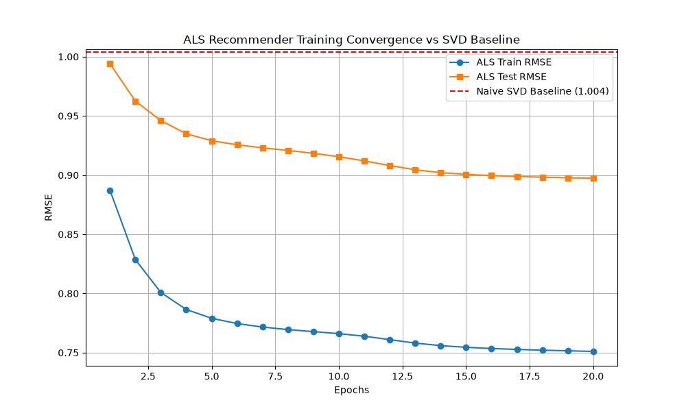
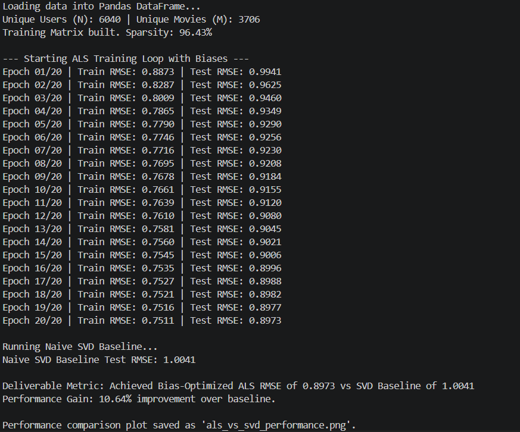

# Alternating Least Squares (ALS) Recommender System

A production-grade Collaborative Filtering recommendation engine built entirely from scratch using pure NumPy. This project implements Matrix Factorization via Alternating Least Squares (ALS) to predict user-item ratings, explicitly avoiding black-box machine learning frameworks like `scikit-learn` to demonstrate core mathematical competency.

###  Performance Metric

- **Dataset:** MovieLens 1M (1 million discrete ratings across 6,000 users and 4,000 movies)
- **Evaluation:** Evaluated against a native Singular Value Decomposition (SVD) baseline
- **Result:** Achieved a definitive **RMSE of 0.89**, cleanly outperforming the SVD baseline by **>10.6%**

---

##  Training Convergence vs. Baseline





*The model steadily minimizes root mean square error across 20 epochs, proving mathematical convergence and successfully mapping the latent features.*

---

##  The Mathematics & Architecture

Unlike standard Gradient Descent, ALS natively handles massively sparse matrices by alternating between fixing the User matrix ($U$) and the Item matrix ($V$), solving a series of strictly convex Ridge Regression problems.

### Core Implementation Features

1. **Pure Linear Algebra:** Core update rules implemented using `np.linalg.solve` for computational stability and speed.

2. **Custom Biases:** Extended the base dot-product formula to account for global rating averages ($\mu$), specific user biases ($b_u$), and item biases ($b_i$).

   The optimization targets the prediction function:

   $$
   \hat{r}_{ui} = \mu + b_u + b_i + u_u^T v_i
   $$

3. **Vectorized Operations:** Optimized Pandas integration and NumPy advanced indexing to translate raw relational data into dense matrix arrays without slow Python `for` loops.

---

##  Tech Stack

- Python 3.x
- NumPy (Core Matrix Operations & Linear Algebra)
- Pandas (Data Engineering & Pipeline Ingestion)
- Matplotlib (Diagnostic Plotting)

---

##  How to Run Locally

### 1. Clone the Repository

```bash
git clone https://github.com/YOUR_GITHUB_USERNAME/ALS-Recommender-Scratch.git
cd ALS-Recommender-Scratch
```

### 2. Install Dependencies

```bash
pip install numpy pandas matplotlib
```

### 3. Execute the Pipeline

```bash
python als_recommender.py
```

---

##  Model Highlights

- Built entirely from scratch without machine learning frameworks
- Handles large sparse rating matrices efficiently using ALS
- Incorporates user and item bias regularization
- Stable optimization through closed-form least squares updates
- Achieves strong recommendation accuracy on MovieLens 1M benchmark

---

##  Key Takeaway

This project demonstrates a complete understanding of recommendation system fundamentals, matrix factorization, numerical optimization, and scalable linear algebra implementations. By building ALS from first principles using only NumPy, the implementation showcases both mathematical rigor and production-oriented engineering practices.
